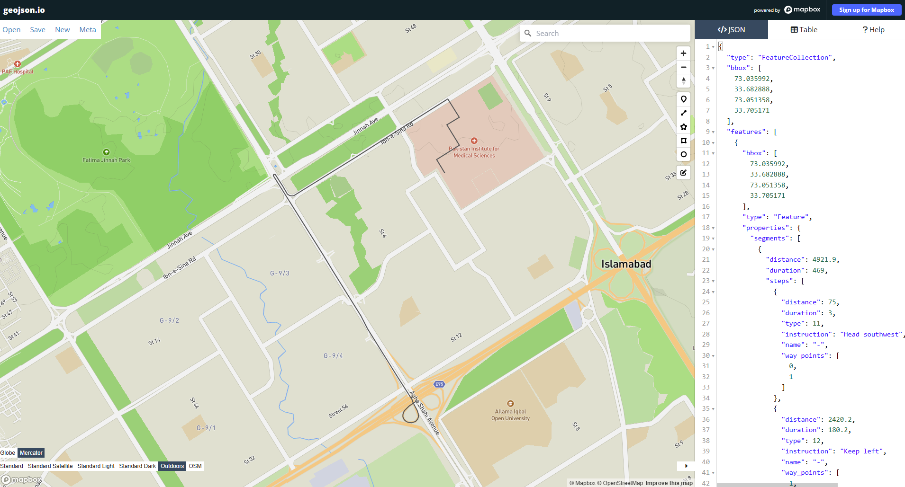
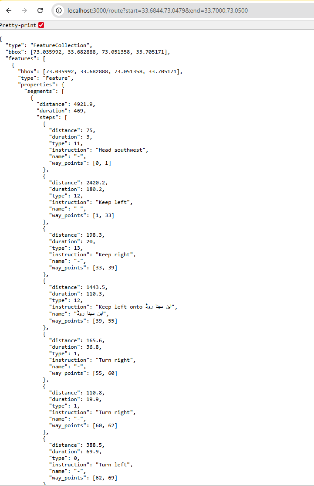

# Simple Routing API

A lightweight, high-performance REST API that calculates routing paths between two geographic coordinates. Built with Node.js and Express, serving as a robust wrapper around the OpenRouteService engine.

### Table of Contents

Project Overview

* System Architecture & Design
* Prerequisites
* Output Screenshots
* Installation & Setup
* API Documentation
* Code Breakdown

# Project Overview
This service provides a streamlined endpoint for geospatial routing. It accepts start and end coordinates (Latitude, Longitude) and returns a GeoJSON LineString representing the optimal driving route, along with distance and duration metrics.

**Key Features:**

* **Simplified Interface:** Abstracts complex routing parameters into a clean URL structure.
* **GeoJSON Standard:** Returns data in standard RFC 7946 GeoJSON format, ready for Mapbox, Leaflet, or OpenLayers.
* **Coordinate Normalization:** Automatically handles the conversion between Input (Lat, Lon) and GIS Standard (Lon, Lat).

# System Architecture & Design

**Why a Wrapper API?**
Instead of connecting the frontend directly to a third-party routing engine, I implemented a Middleware/Wrapper Pattern.
1. **Abstraction & Decoupling:** The client application does not need to know which routing engine is being used (OSRM, Mapbox, or OpenRouteService). If we need to switch providers later (e.g., for cost or coverage reasons), we only change the backend code; the frontend remains untouched.
2. **Data Normalization:** Geographic standards vary. Frontend inputs are typically Lat,Lon (Google Maps style), while routing engines often require Lon,Lat (GeoJSON style). This API creates a centralized place to handle this transformation, reducing bugs in client apps.
3. **Security:** This design prevents exposing sensitive API Keys to the client-side browser.

**Data Flow**
User Request (Lat,Lon) ➡️ **Node.js API** (Validation & Transformation) ➡️ OpenRouteService (Lon,Lat) ➡️ **Node.js API** (JSON Formatting) ➡️ Client (GeoJSON)

# Prerequisites
* **Node.js** (v14 or higher)
* **npm** (Node Package Manager)
* An API Key from OpenRouteService (Free tier available)

# Output Screenshots
### Initial Map View

### Initial Map View

# Installation & Setup

1. **Clone the Repository**
`git clone https://github.com/your-username/routing-api.git`
`cd routing-api`

2. **Install Dependencies**
`npm install`

3. **Configuration** Open index.js and replace the placeholder key:
`const API_KEY = 'YOUR_ACTUAL_API_KEY';`

(Note: In a production environment, this would be stored in a .env file using dotenv)

4. **Run the Server**
`node index.js`

Output: `Routing API running at http://localhost:3000`

# API Documentation

**Get Route**
Calculates the driving route between two points.

Endpoint: `GET /route`

**Parameters:**

Parameter   Type        Required    Description                     Format
`start`      string      Yes        Starting point coordinates   Lat,Lon (e.g., 33.6844,73.0479)
`end`        string      Yes        Destination coordinates      Lat,Lon (e.g., 33.7000,73.0500)

**Sample Request:**
`HTTP`
`GET http://localhost:3000/route?start=33.6844,73.0479&end=33.7000,73.0500`

**Sample Response (Success - 200 OK):**
`JSON`

`{`
  `"type": "FeatureCollection",`
  `"features": [`
   ` {`
    `  "type": "Feature",`
     ` "properties": {`
      `  "summary": {`
       `     "distance": 2450.5,`
        `    "duration": 320.1`
        `}`
      `},`
      `"geometry": {`
       ` "type": "LineString",`
        `"coordinates": [`
         ` [73.0479, 33.6844],`
         ` [73.0482, 33.6850],`
         ` ...`
        `]`
     ` }`
    `}`
  `]`
`}`

# Code Breakdown
The core logic resides in `index.js`. Here is how the problem was solved:

1. **Input Validation**
Before processing, we ensure the request is valid to prevent wasted API calls.

`JavaScript`

`const { start, end } = req.query;`
`if(!start || !end) return res.status(400).send("Missing coordinates");`

2. **Coordinate Transformation**
This is the most critical GIS step.

* Input: 33.6844, 73.0479 (Latitude, Longitude)
* Required Output: 73.0479, 33.6844 (Longitude, Latitude)

`JavaScript`

`// .split converts string to array`
`// .reverse swaps the order for GeoJSON compliance`
`const startCoords = start.split(',').reverse(); `
`const endCoords = end.split(',').reverse();`

3. **External Service Integration**
We use `axios` to make an asynchronous HTTP request to the routing engine.

`JavaScript`

`const response = await axios.get(orsUrl, {`
    `params: {`
        `api_key: '...',`
        `start: startCoords.join(','), // Re-joins array into string "lon,lat"`
        `end: endCoords.join(',')`
    `}`
`});`

4. **Error Handling**
The entire logic is wrapped in a `try/catch` block. If the external routing service fails (e.g., unreachable server, invalid key), our API catches the error and returns a clean `500` status code instead of crashing.

**Deployment**
Render is the new industry standard for free Node.js hosting. It connects to your GitHub and looks very professional.

# Future Improvements
* **Environment Variables:** Move API keys to .env for better security.
* **Caching:** Implement Redis caching to store frequent routes and reduce API usage.
* **Profile Selection:** Add a parameter to support Walking/Cycling profiles.